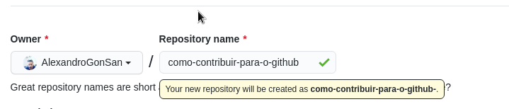
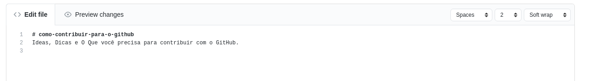
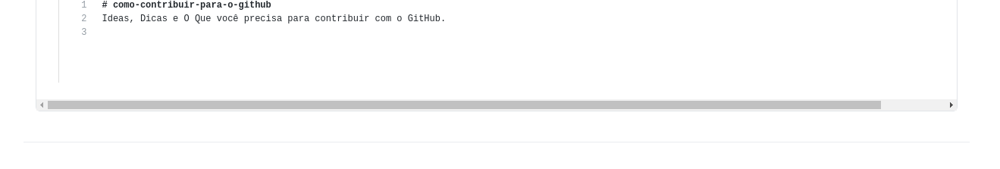

# como-contribuir-para-o-github
Ideas, Dicas e O Que você precisa para contribuir com o GitHub.
* Mover o input-check da página de criar repositórios para cima
 
- Espelhar verticalmente com base no meio do input
* Alterar o editor de markdown para incluir botões como inserir imagens
 
  - para inserir imagens o usuário pode fazer upload dos arquivos sem estarem previamente no github
  - o upload pode ser feito de uma url
# Como prosseguir
- envie para o GitHub
- faça extenssões de navegadores, você pode começar por [What are extensions?](https://developer.chrome.com/extensions)
- torne público, faça seu GitHub e poste nele e me envie um link para conferir por [Issues](https://github.com/AlexandroGonSan/AlexandroGonSan/issues)
# O que mais fazer
* Implementar sessão de comentários em cada arquivo
- você pode usar a api do github para se conectar com sua extenssão de navegador e salvar os arquivos do usuários nos repositórios do próprio usuário

# Como Fazer
- Para abrir a página de novo repositório vá para a página [inicial](https://github.com/) e clique em Novo/New
- Para editar arquivos e ver como fazer o layout veja essa [página](https://github.com/AlexandroGonSan/como-contribuir-para-o-github/blob/main/53f4f02eaa66487f91ad0b109c9e469e690d22453dae45a9b9f6099c9e6fcb5b.png)
- Para ver arquivos e também comentar veja essa [página](https://github.com/AlexandroGonSan/como-contribuir-para-o-github/blob/main/f80edd557ea64ef696f1295ff46dc2cca2101f726aea4ef9b9a04c617eea3fa3.png)
